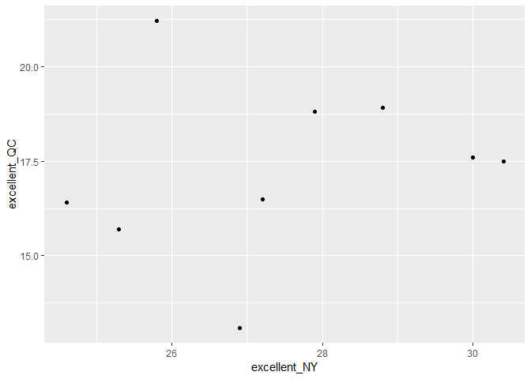

p8105\_hw2\_yz3297
================
Yue Zhao
10/03/2018

Problem 1
---------

``` r
  #read, clean, retain variables and change "entry" from character to logical
  subway_data = 
    read_csv(file = "./data/NYC_Transit_Subway_Entrance_And_Exit_Data.csv") %>%
    janitor::clean_names()  %>%
    select(line, station_name, station_latitude, station_longitude, route1:route11 , entry, vending, entrance_type, ada) %>%
    mutate(entry= if_else(entry == "YES", TRUE, FALSE))
```

    ## Parsed with column specification:
    ## cols(
    ##   .default = col_character(),
    ##   `Station Latitude` = col_double(),
    ##   `Station Longitude` = col_double(),
    ##   Route8 = col_integer(),
    ##   Route9 = col_integer(),
    ##   Route10 = col_integer(),
    ##   Route11 = col_integer(),
    ##   ADA = col_logical(),
    ##   `Free Crossover` = col_logical(),
    ##   `Entrance Latitude` = col_double(),
    ##   `Entrance Longitude` = col_double()
    ## )

    ## See spec(...) for full column specifications.

This code chunk was to read, clean, retain variables and change "entry" from character to logical.

The dataset has 19 variables which are Line, Station\_name, Station\_latitude, Station\_longitude, route1-route11 , Entry, Vending, Entrance\_type, ADA compliance. It is 1868\*19 in dimension. This dataset is obviously not tidy because route has multiple variables. We need to transform the dataset from wide to long form.

``` r
    count(distinct(subway_data,station_name, line)) 
```

    ## # A tibble: 1 x 1
    ##       n
    ##   <int>
    ## 1   465

There are 465 distinct stations. (identified by name and line)

``` r
    count(distinct(subway_data,station_name, line, ada), ada== TRUE)
```

    ## # A tibble: 2 x 2
    ##   `ada == TRUE`     n
    ##   <lgl>         <int>
    ## 1 FALSE           381
    ## 2 TRUE             84

There are 84 distinct stations which are ADA compliant.

``` r
    count(subway_data, vending == "NO", entry == TRUE)
```

    ## # A tibble: 4 x 3
    ##   `vending == "NO"` `entry == TRUE`     n
    ##   <lgl>             <lgl>           <int>
    ## 1 FALSE             FALSE               1
    ## 2 FALSE             TRUE             1684
    ## 3 TRUE              FALSE             114
    ## 4 TRUE              TRUE               69

``` r
    count(subway_data, vending == "NO")
```

    ## # A tibble: 2 x 2
    ##   `vending == "NO"`     n
    ##   <lgl>             <int>
    ## 1 FALSE              1685
    ## 2 TRUE                183

The proportion of station entrances without vending allow entrance is 69/183 0.3770492.

``` r
    subway_data = gather(subway_data, key = route_number , value = route_name, route1:route11)
```

The code chunk above is to change the dataset from wide form to long form.

``` r
    count(distinct(subway_data, station_name, line, route_name), route_name == "A")
```

    ## # A tibble: 3 x 2
    ##   `route_name == "A"`     n
    ##   <lgl>               <int>
    ## 1 FALSE                 921
    ## 2 TRUE                   60
    ## 3 NA                    461

``` r
    count(distinct(subway_data, station_name, line, route_name, ada), route_name == "A" , ada == TRUE)
```

    ## # A tibble: 6 x 3
    ##   `route_name == "A"` `ada == TRUE`     n
    ##   <lgl>               <lgl>         <int>
    ## 1 FALSE               FALSE           644
    ## 2 FALSE               TRUE            277
    ## 3 TRUE                FALSE            43
    ## 4 TRUE                TRUE             17
    ## 5 NA                  FALSE           380
    ## 6 NA                  TRUE             81

There are 60 distinct stations serve the A train. Of the stations that serve the A train, 17 of them are ADA compliant.

Problem 2
---------

``` r
library(readxl)

  trashwheel_data = 
      read_excel("data/HealthyHarborWaterWheelTotals2018-7-28.xlsx", sheet = "Mr. Trash Wheel" , range = "A2:N337") %>%
      janitor::clean_names()  %>%
      rename(weight = weight_tons, volume = volume_cubic_yards)   %>%
      #read, clean names and rename weight and volume
      
      na.omit()  %>%
      #omit the redundant observations
    
      mutate(sports_balls = as.integer(sports_balls))
      #convert sports balls to an integer variable
  
  trashwheel_data
```

    ## # A tibble: 285 x 14
    ##    dumpster month  year date                weight volume plastic_bottles
    ##       <dbl> <chr> <dbl> <dttm>               <dbl>  <dbl>           <dbl>
    ##  1        1 May    2014 2014-05-16 00:00:00   4.31     18            1450
    ##  2        2 May    2014 2014-05-16 00:00:00   2.74     13            1120
    ##  3        3 May    2014 2014-05-16 00:00:00   3.45     15            2450
    ##  4        4 May    2014 2014-05-17 00:00:00   3.1      15            2380
    ##  5        5 May    2014 2014-05-17 00:00:00   4.06     18             980
    ##  6        6 May    2014 2014-05-20 00:00:00   2.71     13            1430
    ##  7        7 May    2014 2014-05-21 00:00:00   1.91      8             910
    ##  8        8 May    2014 2014-05-28 00:00:00   3.7      16            3580
    ##  9        9 June   2014 2014-06-05 00:00:00   2.52     14            2400
    ## 10       10 June   2014 2014-06-11 00:00:00   3.76     18            1340
    ## # ... with 275 more rows, and 7 more variables: polystyrene <dbl>,
    ## #   cigarette_butts <dbl>, glass_bottles <dbl>, grocery_bags <dbl>,
    ## #   chip_bags <dbl>, sports_balls <int>, homes_powered <dbl>

This code chunk is to read, clean names, rename weight and volume, omit the redundant observations and convert sports balls to an integer variable for Mr. Trash Wheel dataset.

``` r
    precip2017_data=
      read_excel("data/HealthyHarborWaterWheelTotals2018-7-28.xlsx", sheet = "2017 Precipitation" , range = "A2:B15") %>%
      na.omit() %>%
      mutate(year = 2017)
      #read, clean data and add year= 2017
      
    precip2016_data=  
      read_excel("data/HealthyHarborWaterWheelTotals2018-7-28.xlsx", sheet = "2016 Precipitation" , range = "A2:B15") %>%
      na.omit() %>% 
      mutate(year = 2016)
      #read, clean data and add year= 2016
      
    precip_data=
      bind_rows(precip2017_data, precip2016_data) %>%
      janitor::clean_names()  %>%
      mutate(month = month.name[month])
      #append the datasets, clean the names and convert month to a character variable
  
    precip_data
```

    ## # A tibble: 24 x 3
    ##    month     total  year
    ##    <chr>     <dbl> <dbl>
    ##  1 January    2.34  2017
    ##  2 February   1.46  2017
    ##  3 March      3.57  2017
    ##  4 April      3.99  2017
    ##  5 May        5.64  2017
    ##  6 June       1.4   2017
    ##  7 July       7.09  2017
    ##  8 August     4.44  2017
    ##  9 September  1.95  2017
    ## 10 October    0     2017
    ## # ... with 14 more rows

This code chunk is to read the precipitation datasets and combine the datasets.

The description about the data (r inline code used): The number of observations in Mr. Trashwheel Dataset is 285. The number of observations in the Precipitation Dataset is 24.

Key variables in Mr. Trashwheel Dataset are dumpster, month, weight, volume, sports balls. Key variables in Precipitation Dataset are month, total precipitation, year.

The total precipitation in 2017 is 32.93. The median number of sports balls in a dumpster in 2016 is 26.

Problem 3
---------

``` r
devtools::install_github("p8105/p8105.datasets")
```

    ## Skipping install of 'p8105.datasets' from a github remote, the SHA1 (21f5ad1c) has not changed since last install.
    ##   Use `force = TRUE` to force installation

``` r
library(p8105.datasets)

data(brfss_smart2010)
head(brfss_smart2010)
```

    ## # A tibble: 6 x 23
    ##    Year Locationabbr Locationdesc Class Topic Question Response Sample_Size
    ##   <int> <chr>        <chr>        <chr> <chr> <chr>    <chr>          <int>
    ## 1  2010 AL           AL - Jeffer~ Heal~ Over~ How is ~ Excelle~          94
    ## 2  2010 AL           AL - Jeffer~ Heal~ Over~ How is ~ Very go~         148
    ## 3  2010 AL           AL - Jeffer~ Heal~ Over~ How is ~ Good             208
    ## 4  2010 AL           AL - Jeffer~ Heal~ Over~ How is ~ Fair             107
    ## 5  2010 AL           AL - Jeffer~ Heal~ Over~ How is ~ Poor              45
    ## 6  2010 AL           AL - Jeffer~ Heal~ Fair~ Health ~ Good or~         450
    ## # ... with 15 more variables: Data_value <dbl>,
    ## #   Confidence_limit_Low <dbl>, Confidence_limit_High <dbl>,
    ## #   Display_order <int>, Data_value_unit <chr>, Data_value_type <chr>,
    ## #   Data_Value_Footnote_Symbol <chr>, Data_Value_Footnote <chr>,
    ## #   DataSource <chr>, ClassId <chr>, TopicId <chr>, LocationID <chr>,
    ## #   QuestionID <chr>, RESPID <chr>, GeoLocation <chr>

``` r
brfssnew_data=brfss_smart2010 %>%
  janitor::clean_names()  %>%
  filter(topic=="Overall Health")   %>%
  select(year,locationabbr, locationdesc, response, data_value)%>%
  spread(key=response, value= data_value ) %>%
  #clean the names, filter the overall health topic, drop other variables and turning data from long to wide
  
  janitor::clean_names()  %>%
  mutate(exc_or_verygood= excellent + very_good ) %>%
  #clean the names again after turning long to wide and create a new variable

  na.omit()
  #omit the na

brfssnew_data
```

    ## # A tibble: 2,109 x 9
    ##     year locationabbr locationdesc excellent  fair  good  poor very_good
    ##    <int> <chr>        <chr>            <dbl> <dbl> <dbl> <dbl>     <dbl>
    ##  1  2002 AK           AK - Anchor~      27.9   8.6  23.8   5.9      33.7
    ##  2  2002 AL           AL - Jeffer~      18.5  12.1  32.7   5.9      30.9
    ##  3  2002 AR           AR - Pulask~      24.1  12.5  29.9   4.2      29.3
    ##  4  2002 AZ           AZ - Marico~      21.6  10.3  26.9   4.6      36.6
    ##  5  2002 AZ           AZ - Pima C~      26.6   7.5  31.9   3.9      30.1
    ##  6  2002 CA           CA - Los An~      22.7  14.3  28.7   4.5      29.8
    ##  7  2002 CO           CO - Adams ~      21.2  14.4  29     4.2      31.2
    ##  8  2002 CO           CO - Arapah~      25.5   8    29.3   2.1      35.2
    ##  9  2002 CO           CO - Denver~      22.2  11.1  36.6   3        27.1
    ## 10  2002 CO           CO - Jeffer~      23.4  11.4  26.3   2.4      36.6
    ## # ... with 2,099 more rows, and 1 more variable: exc_or_verygood <dbl>

Answers to the questions (used inline code for the numbers if no code chunk is showing)

There are 400 unique locations in the dataset (if counting the NAs, it is 404). There are 51 location abbreviations for states (or district), so we know all 50 states and Washington DC were represented.

``` r
count(brfssnew_data, locationabbr)
```

    ## # A tibble: 51 x 2
    ##    locationabbr     n
    ##    <chr>        <int>
    ##  1 AK              11
    ##  2 AL              17
    ##  3 AR              21
    ##  4 AZ              30
    ##  5 CA              52
    ##  6 CO              59
    ##  7 CT              47
    ##  8 DC               9
    ##  9 DE              27
    ## 10 FL             117
    ## # ... with 41 more rows

The state which has the most observation is New Jersey. It appeared 144 times. (The two NAs are taken out so it could also be 146)

In 2002, the median of the Excellent response value is 23.6.

``` r
ggplot(filter(brfssnew_data,year==2002), aes(x = excellent)) + 
  geom_histogram()
```

    ## `stat_bin()` using `bins = 30`. Pick better value with `binwidth`.


``` r
  #histogram
```

Histogram of Excellent response values in 2002

``` r
  county_data1= filter(brfssnew_data, locationdesc=="NY - New York County") %>%
            select(year, excellent) %>%
            rename(excellent_NY = excellent)
  #subseting the New York County data

  county_data2 = filter(brfssnew_data, locationdesc=="NY - Queens County")%>%
            select(year, excellent) %>%
            rename(excellent_QC = excellent)
  #subseting the Queens County data
  
  county_data =left_join(county_data1,county_data2, by = "year")
  #combine the data
       
  ggplot(county_data, aes(x = excellent_NY, y = excellent_QC)) + geom_point()
```



``` r
  #scatter plot
```

Scatter Plot of Execellent response values in New York County and Queens County from 2002 to 2010. (There are 9 points)
